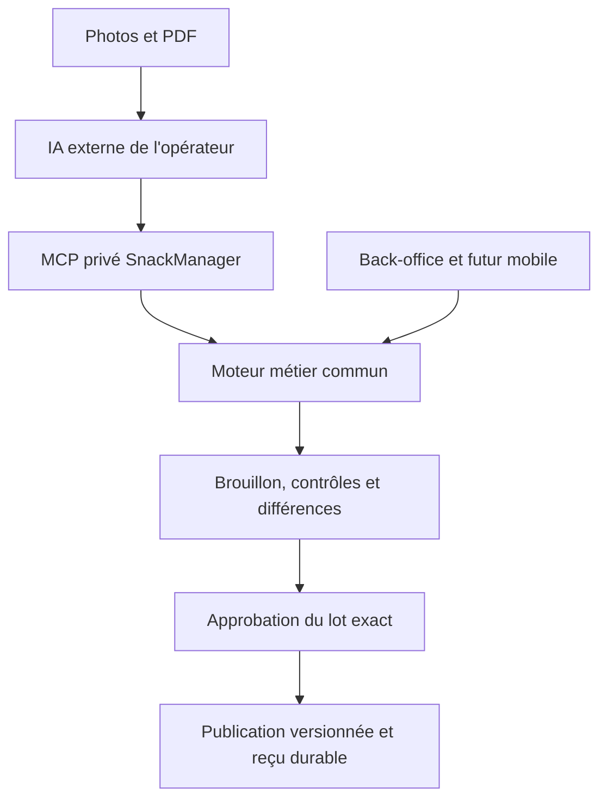

# Intégration IA / MCP — proposition pour une roadmap future

**Décision du fondateur du 12 septembre 2026 : REPORTÉ, NON ENGAGÉ.** Conserver la proposition pour une reprise future. La priorité est la finalisation des applications et la stabilité de leurs bases. Cette note ne déclenche aucun développement IA/MCP, migration, connexion fournisseur ni offre commerciale.

Le [suivi unique des demandes](SUITE-APRES-COMMERCE.md) conserve l'ordre de travail et les preuves de livraison. Ce document est une proposition d'architecture à réévaluer lors de sa reprise, pas une décision technique définitivement adoptée ni une fonctionnalité disponible.

## 1. Besoin à conserver

Le fondateur utilise déjà Claude Code, Codex et parfois Gemini pour lire des photos ou PDF de menus, produire des données structurées puis les intégrer dans SnackManager, comme pour Classfood. Industrialiser ce parcours doit permettre :

- une intégration assistée par l'opérateur avec ses IA habituelles, sans leur donner le dépôt de code ni les identifiants des bases ;
- une découverte du contrat de données réellement accepté par SnackManager ;
- des créations et mises à jour contrôlées, répétables et sans doublons ;
- une vérification simple par le restaurateur dans le back-office ;
- à terme, un dépôt de documents directement dans l'application, utilisant le même moteur métier.

L'hypothèse d'une prestation autour de 50 € reste à éprouver sur des dossiers réels. Aucun tarif, délai ou périmètre commercial n'est engagé par cette note.

## 2. État observé et frontière avec la finalisation actuelle

Constats issus de la lecture du code correspondant au staging `aefdf974f3c24dfb7d2d7ab484eb297a0502aa1c` ; ils doivent être revérifiés à la reprise :

| Sujet | Existant | Écart identifié |
| --- | --- | --- |
| Import de carte | [ImportModal](../../apps/web/src/app/admin/menu/ImportModal.tsx) : CSV/XML, aperçu et création de catégories/produits | Pas de parcours riche photo/PDF → brouillon → rapprochement → publication ; les imports répétés peuvent dupliquer les produits |
| Ingrédients | [Fiche ingrédient](../../apps/web/src/app/admin/ingredients/ingredient-drawer.tsx) : famille, prix en supplément, libellé et caractère retirable | Ces réglages ne définissent pas une organisation commerciale personnalisable des suppléments |
| Présentation des suppléments | [Helper partagé](../../packages/client-core/src/supplement-categories.ts) : regroupement selon la famille d'ingrédient reçue de l'API | Libellés et ordre des familles prédéfinis ; aucun classement par un LLM à l'exécution |
| Groupes de choix | [Éditeur des options](../../apps/web/src/app/admin/menu/VariantesOptions.tsx) : groupes, choix, prix, minimums et maximums | Règles `perVariant` conservées mais pas encore éditables dans le formulaire |
| Recettes et projections | [Service supply](../../apps/api/src/modules/supply/supply.service.ts) et [modificateurs de menu](../../apps/api/src/modules/supply/menu-modifiers.ts) | Ingrédients/recettes SQL et produits Mongo, avec projections ; pas de garantie de publication atomique d'un import complet entre ces stockages |

**Le report de l'IA ne reporte pas le pilotage manuel demandé pour les applications.** L'organisation des groupes de suppléments, leur ordre et les règles par taille restent des écarts de finalisation à traiter dans des lots ordinaires, selon les priorités et responsabilités en cours. Les réglages de marque blanche et leur application à toutes les surfaces restent également dans le périmètre de réception. Aucun de ces écarts n'est déclaré résolu par cette note.

Les contrats et validations livrés pendant cette finalisation pourront être réutilisés plus tard. Ne pas créer de serveur MCP, de modèle générique d'agent ou de migration préventive pour anticiper ce chantier reporté.

## 3. Architecture proposée pour la reprise

Un moteur métier d'import commun, appelé par l'API du back-office et par un adaptateur MCP léger. Les composants web et une future application Expo partagent les contrats et règles indépendantes de la plateforme ; leurs interfaces et accès aux documents restent des adaptateurs distincts.

Pistes d'implantation, sans création de ces modules à ce stade : contrats dans `packages/contracts`, règles pures dans `packages/domain`, orchestration et persistance dans un module API dédié. Réutiliser les services métier, droits et contrôles existants ; ne pas dupliquer leurs règles dans le MCP.

Le MCP expose des opérations métier bornées : consulter le contrat, lire le catalogue autorisé, créer/modifier un brouillon, valider, consulter les différences et l'aperçu, publier un lot approuvé, retrouver son état. Il n'expose ni SQL, ni écriture arbitraire dans les collections, ni exécution de code.

Le contrat est versionné et documenté par des schémas d'entrée/sortie, exemples et erreurs structurées indiquant l'élément à corriger. L'IA manipule des références métier stables ou temporaires, résolues côté serveur, sans dépendre du schéma physique des bases. Les erreurs doivent permettre une correction du brouillon sans contourner la validation.

## 4. Données et limites de l'extraction

Le brouillon conserve les documents sources, leur empreinte et, lorsque disponible, la page ou zone de provenance de chaque information. Les champs non déterminables restent explicitement inconnus.

| Notion | Rôle |
| --- | --- |
| Catégorie de produit | Organiser la carte commerciale, par exemple « Sandwichs » |
| Famille d'ingrédient | Classer l'ingrédient pour le métier, par exemple « Fromage » |
| Groupe de choix client | Présenter une personnalisation, par exemple « Ajoutez du fondant » |
| Règles d'application | Définir produits concernés, choix autorisés, minimums/maximums et différences selon le format |

Faire évoluer les groupes de choix existants plutôt que créer une taxonomie parallèle. Les noms, ordre, rattachements et règles doivent rester pilotables manuellement. L'affectation commerciale ne doit pas modifier implicitement la famille métier d'un ingrédient.

**Carte commerciale et recette de production sont distinctes.** Une carte vérifiée peut être publiable sans connaître les grammages. Un PDF commercial ne justifie pas l'invention de quantités, coûts, fournisseurs, allergènes, exclusions ou règles de cumul. « Inconnu » ne devient ni zéro, ni gratuit, ni une recette vide ; une recette absente du document n'autorise pas sa suppression.

La sortie peut décrire produits, variantes, groupes/choix, ingrédients catégorisés, liens de recette connus et prix des suppléments. Les prix sont des montants entiers en centimes avec devise explicite ; les quantités et unités ne sont renseignées que lorsqu'elles sont établies. Les règles publiables passent les mêmes validations serveur que la saisie manuelle.

## 5. Import, concurrence et publication

Parcours cible : `brouillon → validation → différences → approbation → publication → reçu`.

1. Rapprocher les références existantes. Une ressemblance de nom propose un rapprochement ; les ambiguïtés ne sont pas fusionnées silencieusement.
2. Distinguer création, modification et suppression explicites. L'absence d'un produit dans un document n'autorise pas son archivage. Préserver les identités, recettes et règles qui ne font pas partie de la modification approuvée.
3. Valider les liens produits/variantes/groupes/choix/ingrédients, les bornes de choix, les unités et les prix. Simuler des configurations représentatives avant publication.
4. Lier l'approbation à l'acteur, au restaurant, à la révision du brouillon, à l'empreinte des différences et à la version source du catalogue. Une édition concurrente exige un rapprochement et une nouvelle validation du résultat modifié.
5. Persister l'identifiant d'opération, l'empreinte de la demande et un reçu durable. Une relance après coupure retrouve la même opération ; elle ne crée pas une seconde intégration.
6. Journaliser les décisions et permettre une correction par nouvelle version de catalogue. Un retour de carte ne réécrit pas l'historique des commandes ou des paiements.

**La cohérence Mongo/PostgreSQL est un point d'architecture à résoudre avant toute promesse de mise à jour globale fiable.** Le service actuel écrit les recettes SQL puis leurs projections Mongo ; certaines lectures peuvent également actualiser la projection. Une transaction SQL ou une suite de requêtes existantes ne suffit donc pas.

Piste recommandée à instruire : préparer une génération de catalogue, vérifier les projections, puis activer une autorité de version unique sous contrôle de concurrence. Tous les lecteurs, écrivains BO et mécanismes de projection concernés doivent respecter cette autorité. La tarification serveur et les commandes en cours conservent leurs preuves. Les stocks, ruptures et mouvements restent des données opérationnelles distinctes et ne sont pas réinitialisés par l'import.

## 6. Accès et expérience opérateur/restaurateur

MCP distant authentifié, transport HTTP standard et autorisation OAuth selon les clients effectivement retenus. Les identités, droits, capacités et restaurant autorisé sont vérifiés côté serveur à chaque opération ; un `tenantId` envoyé par le modèle ne constitue pas une autorisation.

Les droits de préparation et de publication sont distincts. L'approbation porte sur le résultat exact ; une confirmation dans l'outil IA ne remplace pas le contrôle serveur. Les documents sont des données non fiables à extraire, jamais des instructions autorisées. Définir la conservation des documents, leur suppression et la traçabilité lors du cadrage du pilote.

Pour l'opérateur : documents dans son outil habituel, découverte du contrat, préparation et corrections par le MCP, puis comparaison et aperçu dans SnackManager. Pour le restaurateur : dépôt ou transmission des documents, revue simple des ambiguïtés et validation de la carte, sans obligation d'installer un client MCP. Une extraction IA intégrée ultérieure utilisera le même moteur et les mêmes contrats.

## 7. Reprise future et critères de réception

**Aucune date ni reprise automatique.** Reprendre ce sujet après la finalisation/stabilisation prioritaire, avec arbitrage explicite du fondateur dans le suivi unique. À ce moment : rapprocher code, contrats, PR et travaux des autres agents ; réévaluer les clients MCP et les décisions de cohérence des données.

Première livraison proposée : une intégration de carte complète et contrôlée pour l'opérateur, avec accès MCP privé, brouillons, rapprochement, revue BO et publication durable. Livrer ce parcours vertical avant d'étendre l'automatisation à d'autres domaines. Le dépôt client et l'extraction intégrée peuvent ensuite compléter le parcours sans moteur parallèle.

Critères à exiger avant d'annoncer ce service disponible :

- Toutes les pages/rubriques des documents sont comptabilisées ; prix, formats et règles publiés sont sourcés ou confirmés ; aucune ambiguïté bloquante ne subsiste.
- Réimport, réponse perdue, reprise après panne et édition BO concurrente sont recettés sans doublon ni écrasement silencieux.
- Groupes/choix/recettes restent liés correctement ; les configurations représentatives donnent le même prix et les mêmes informations sur les surfaces concernées.
- Isolation entre restaurants, permissions de publication et refus des brouillons périmés sont vérifiés côté serveur.
- Publication cohérente entre stockages et conservation des commandes historiques sont démontrées sur l'application exécutée.
- Recette sur les clients MCP retenus, CI du lot, révision exacte servie en staging et limites réelles sont documentées ; les mocks ne prouvent pas l'interopérabilité distante.

Mesurer sur de vrais dossiers : temps humain total médian et au 90e percentile, taux de validation sans reprise, corrections après publication et coût complet. Définir l'offre commerciale selon qualité des documents et complexité des menus. Le prix indicatif de 50 € ne promet pas une reconstitution illimitée des recettes ou des informations absentes.

## 8. Extensions possibles, également reportées

| Domaine | Proposition future | Contrôle métier à conserver |
| --- | --- | --- |
| Carte et tarifs | Carte saisonnière, évolution de prix | Différences, règles par variante, commandes existantes |
| Fournisseurs et stocks | Bon de livraison vers réception proposée | Quantités/unités, rapprochement et validation de la réception |
| Marque blanche et TV | Préparation de textes, identité, organisation et écrans | Aperçu, identité centralisée, publication autorisée |
| Analyse d'activité | Questions sur ventes et marges | Données établies, lecture autorisée, périmètre du restaurant |
| Promotions et fidélité | Préparation et simulation d'une campagne | Éligibilité, coût, plafonds et validation avant activation |

Mutualiser contrats, droits, brouillons, preuves et reprises lorsqu'ils servent réellement plusieurs domaines. Conserver les validateurs propres à chaque métier. Cette perspective ne justifie pas un framework universel d'agents préalable à la finalisation des applications.

## 9. Références de la proposition

Références officielles consultées lors de la discussion du 12 septembre 2026 ; vérifier leurs versions et la compatibilité réelle lors de la reprise :

- [MCP dans Codex](https://developers.openai.com/codex/extend/mcp), [Claude Code](https://code.claude.com/docs/en/mcp) et [Gemini CLI](https://geminicli.com/docs/tools/mcp-server/) — le support d'un CLI ne garantit pas celui de toutes les autres interfaces du fournisseur.
- [Schémas des outils MCP](https://modelcontextprotocol.io/specification/2026-07-28/server/tools), [autorisation HTTP](https://modelcontextprotocol.io/specification/2026-07-28/basic/authorization) et [transport Streamable HTTP](https://modelcontextprotocol.io/specification/2026-07-28/basic/transports/streamable-http).
- [Annotations des outils](https://blog.modelcontextprotocol.io/posts/2026-03-16-tool-annotations/) : indications pour les clients, pas garanties d'autorisation ou de sûreté serveur.
